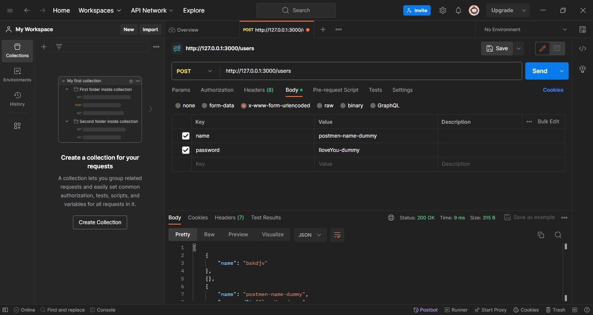

```bash
cd D:\hard-disk-repos\node-practice\express\authentication\web-dev-simp-auth
npm innit -y
npm i express bcrypt
npm i --save-dev nodemon
```

# ERRORS
## error01
when using `.rest` ext to sent POST request, the body is returning `undefined`
## fix01
the reason is not yet found
remedy: use POSTMAN


# hashing password
1. create a `salt`
2. use that `salt` to create hash